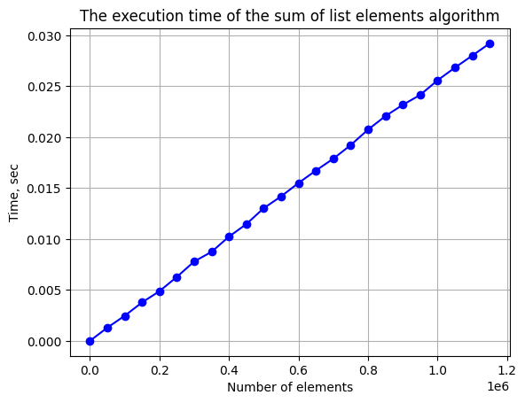
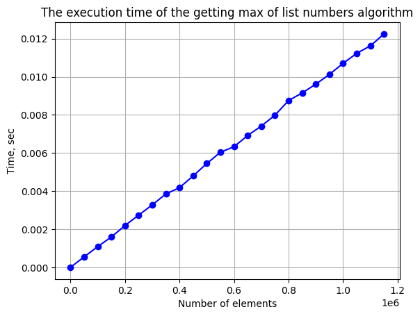
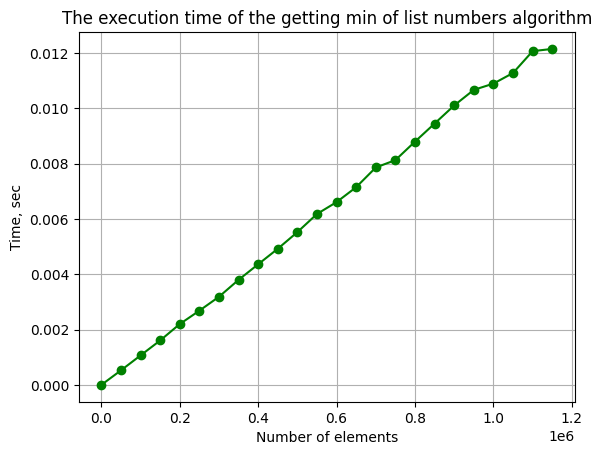
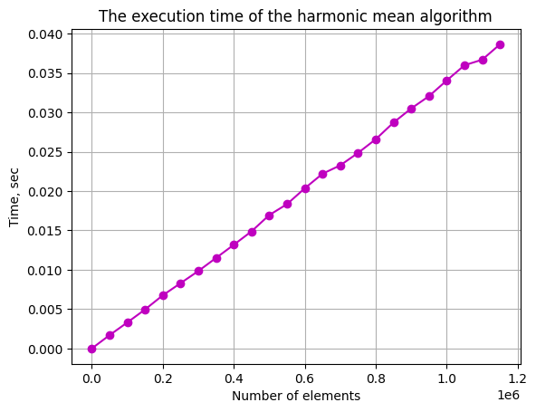
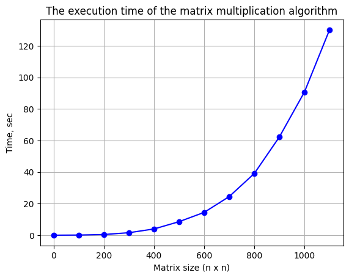

# Эмпирический анализ временной сложности алгоритмов

## Цель работы

Эмпирический анализ временной сложности алгоритмов.

## Работу выполнил
Цыганков Д.С. ИУ10-37

## Задания 
### Задание 1.2
```python
import random
import time
import matplotlib.pyplot as plt

def sum_elements(v: list):
    total = 0
    for num in v:
        total += num
    return total

student_number = 8 
N = 20 - student_number

items = range(1, 10**5 * N, 50000)
times = []

print(f"Задание 1.2 | Вариант {student_number} | Точек: {len(list(items))}")

for n in items:
    total_time = 0
    
    for _ in range(20):
        vector = [random.randint(1, 10) for _ in range(n)]
        
        start_time = time.perf_counter()
        result = sum_elements(vector)
        end_time = time.perf_counter()
        
        total_time += (end_time - start_time)
    
    avg_time = total_time / 20
    times.append(avg_time)
    print(f"n={n}: {avg_time:.6f} сек")

plt.plot(items, times, 'bo-')
plt.title('The execution time of the sum of list elements algorithm')
plt.xlabel('Number of elements')
plt.ylabel('Time, sec')
plt.grid(True)
plt.show()
```



## Задание 1.5
```python
import random
import time
import matplotlib.pyplot as plt

def find_max(v: list):
    max_num = 0
    for num in v:
        if num > max_num:
            max_num = num
    return max_num

student_number = 8 
N = 20 - student_number

items = range(1, 10**5 * N, 50000)
times = []

print(f"Задание 1.5 | Вариант {student_number} | Точек: {len(list(items))}")

for n in items:
    total_time = 0
    
    for _ in range(20):
        vector = [random.randint(1, 10) for _ in range(n)]
        
        start_time = time.perf_counter()
        result = find_max(vector)
        end_time = time.perf_counter()
        
        total_time += (end_time - start_time)
    
    avg_time = total_time / 20
    times.append(avg_time)
    print(f"n={n}: {avg_time:.6f} сек")

plt.plot(items, times, 'bo-')
plt.title('The execution time of the getting max of list numbers algorithm')
plt.xlabel('Number of elements')
plt.ylabel('Time, sec')
plt.grid(True)
plt.show()
```


## Задание 1.6
```python
import random
import time
import matplotlib.pyplot as plt

def find_min(v: list):
    min_num = float('inf')
    for num in v:
        if num < min_num:
            min_num = num
    return min_num

student_number = 8 
N = 20 - student_number

items = range(1, 10**5 * N, 50000)
times = []

print(f"Задание 1.6 | Вариант {student_number} | Точек: {len(list(items))}")

for n in items:
    total_time = 0
    
    for _ in range(20):
        vector = [random.randint(1, 10) for _ in range(n)]
        
        start_time = time.perf_counter()
        result = find_min(vector)
        end_time = time.perf_counter()
        
        total_time += (end_time - start_time)
    
    avg_time = total_time / 20
    times.append(avg_time)
    print(f"n={n}: {avg_time:.6f} сек")

plt.plot(items, times, 'go-')
plt.title('The execution time of the getting min of list numbers algorithm')
plt.xlabel('Number of elements')
plt.ylabel('Time, sec')
plt.grid(True)
plt.show()
```


## Задание 1.8
```python
import random
import time
import matplotlib.pyplot as plt

def harmonic_mean(v: list):
    total_reciprocal = 0
    for num in v:
        if num == 0:
            return 0
        total_reciprocal += 1 / num
    return len(v) / total_reciprocal

student_number = 8 
N = 20 - student_number

items = range(1, 10**5 * N, 50000)
times = []

print(f"Задание 1.8 | Вариант {student_number} | Точек: {len(list(items))}")

for n in items:
    total_time = 0
    
    for _ in range(20):
        vector = [random.randint(1, 10) for _ in range(n)]  # от 1 чтобы не было 0
        
        start_time = time.perf_counter()
        result = harmonic_mean(vector)
        end_time = time.perf_counter()
        
        total_time += (end_time - start_time)
    
    avg_time = total_time / 20
    times.append(avg_time)
    print(f"n={n}: {avg_time:.6f} сек")

plt.plot(items, times, 'mo-')
plt.title('The execution time of the harmonic mean algorithm')
plt.xlabel('Number of elements')
plt.ylabel('Time, sec')
plt.grid(True)
plt.show()
```


## Задание 2
```python
import random
import timeit
import functools
import typing
import matplotlib.pyplot as plt

def get_usage_time(*, number: int = 1, setup: str = 'pass', ndigits: int = 3):
    def decorator(func: typing.Callable) -> typing.Callable:
        @functools.wraps(func)
        def wrapper(*args, **kwargs) -> float:
            usage_time = timeit.timeit(
                lambda: func(*args, **kwargs),
                setup=setup,
                number=number,
            )
            return round(usage_time / number, ndigits)
        return wrapper
    return decorator

def matrix_mult(matrix_a: list, matrix_b: list):
    n = len(matrix_a)
    matrix_c = [[0 for _ in range(n)] for _ in range(n)]

    for y in range(n):
        for x in range(n):
            num = 0
            for i in range(n):
                num += matrix_a[y][i] * matrix_b[i][x]
            matrix_c[y][x] = num
    return matrix_c

student_number = 8  
N = 20 - student_number
items = range(1, 10**2 * N, 100) 
func = get_usage_time()(matrix_mult)

times = [
    func(
        [
            [
                random.randint(1, 3)
                for _ in range(n)
            ]
            for _ in range(n)
        ],
        [
            [
                random.randint(4, 6)
                for _ in range(n)
            ]
            for _ in range(n)
        ]
    )
    for n in items
]

print(f"Матричное умножение | Вариант {student_number} | Точек: {len(list(items))}")

plt.plot(items, times, 'bo-')
plt.title('The execution time of the matrix multiplication algorithm')
plt.xlabel('Matrix size (n x n)')
plt.ylabel('Time, sec')
plt.grid(True)
plt.show()
```

